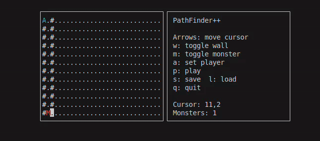
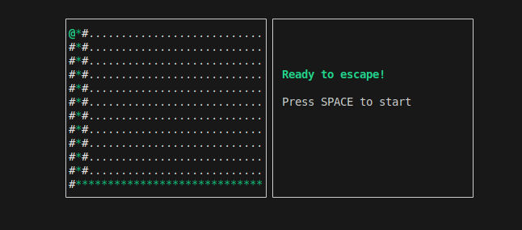
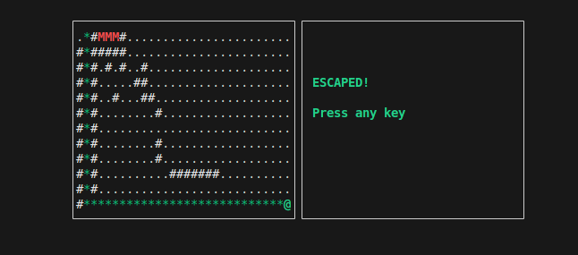

pathfinder++
===========
This project is an interactive console-based maze game implemented in C++ that visually demonstrates the multi-source breadth-first search (BFS) algorithm. It is designed for educational purposes to help understand how BFS can be applied to shortest path problems involving multiple starting points and dynamic spatial constraints.

Features
- BFS solver with animated visualization.
- Interactive terminal UI using ncurses: play/pause, step, speed controls.
- Non-interactive mode for batch runs.


## What is Multi-source BFS?

Multi-source BFS is a variation of the standard BFS algorithm where the search begins simultaneously from multiple initial nodes (sources) instead of just one. This is useful for scenarios where multiple items or agents spread or move across a grid or graph concurrently.
## The Maze Escape Problem

Imagine a maze represented as a 2D grid, with:

- Walls (`#`) that block movement,
- Monsters (`M`) that spread every turn to adjacent cells,
- A Player (`A`) trying to escape to the exit safely.

The challenge is:

- Monsters spread like fire starting from multiple positions (multi-source BFS),
- The player must plan a path to escape without crossing paths with monsters,
- The player can only move to spaces that remain safe ahead of the monster spread.

---

## How Multi-source BFS is Used

1. **Monsters’ Spread Computation:**

   We treat all monster start positions as sources in the BFS queue.

   The BFS iterates simultaneously from these points to calculate the minimum distance (spread time) for monsters to reach each cell.

2. **Safe Pathfinding for Player:**

   Using the monster spread distances, the player's pathfinding BFS ensures the player only moves into cells that the monsters reach later, guaranteeing safety.


Build
-----
You need a C++17 compiler and ncurses development headers.
On Debian/Ubuntu:

```bash
sudo apt-get install build-essential libncurses-dev
```

Then build:

```bash
g++ -o pathfinder pathfinder.cpp -lncurses -std=c++17
```

Run / Examples
--------------
- Start the ncurses TUI (editor + play):

```bash
./pathfinder --tui --input sample_pf_input.txt
```

- Start the interactive CLI editor / play mode:

```bash
./pathfinder --cli-game --input sample_pf_input.txt
```

- If you just want the solver output (YES/NO and path) or to run the program in non-interactive mode:

```bash
./pathfinder_game --input level.txt
# or
./pathfinder_game --play --input level.txt
```

TUI Controls (when running with `--tui`)
-------------------------------------
- Arrow keys: move editor cursor
- w: toggle wall (`#`) at cursor
- m: toggle monster at cursor
- a: set player start (`A`) at cursor
- p: play (starts the escape simulation)
- s: save current level to file
- l: load level from file
- q: quit editor

During play (TUI):
- Space: pause / resume
- + / - : increase / decrease animation speed
- s : toggle path visualization
- q : quit play

CLI Editor / Play (text-mode)
-----------------------------
In interactive CLI mode (run with `--cli-game`), type commands at the prompt:
- `size R C`         - set grid size and clear
- `wall R C`         - toggle wall at (R,C)
- `m R C`            - toggle monster at (R,C)
- `a R C`            - set player start at (R,C)
- `show`             - print grid
- `play`             - start the game (monsters chase player)
- `help`             - print commands
- `save FILE` / `load FILE`

Monster behavior
----------------
- Monsters chase the player using BFS distances: each tick they move one step towards the player along a shortest path (if reachable).
- The solver used to compute a "safe path" still computes a static `monsterDist` (multi-source BFS from monster starts) and ensures the player only moves into cells where his arrival time is strictly less than the monster arrival time for that cell.
- During play, chasing monsters are simulated as a dynamic set and will move after the player each tick.

Winning and losing
------------------
- Win: the player must reach the bottom-right cell of the grid (coordinates `n-1, m-1` in 0-based indexing).
- Lose: if at any tick a monster occupies the player's cell (contact) the player is caught and the round ends.
- If the player starts on a monster cell, the run is aborted immediately (instant death).
## Demo


## Screenshots and GIFs




##  Contributing

Found a bug or want to suggest a feature? Feel free to:
1. Report issues
2. Submit pull requests with improvements
3. Share your algorithm visualizations